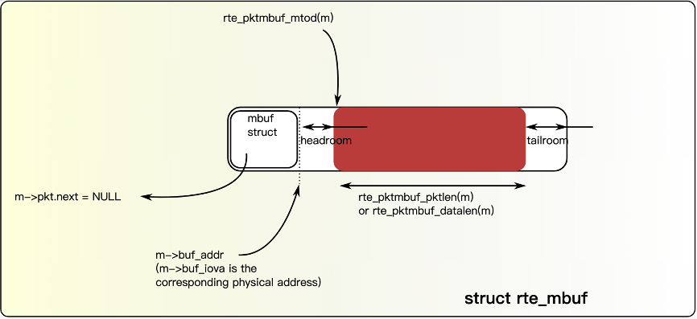
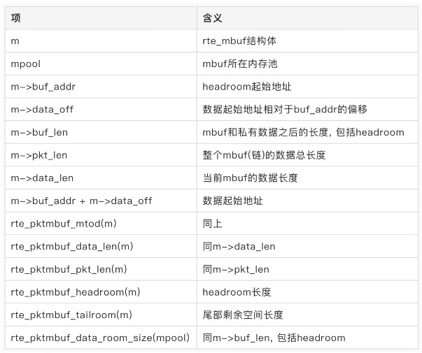
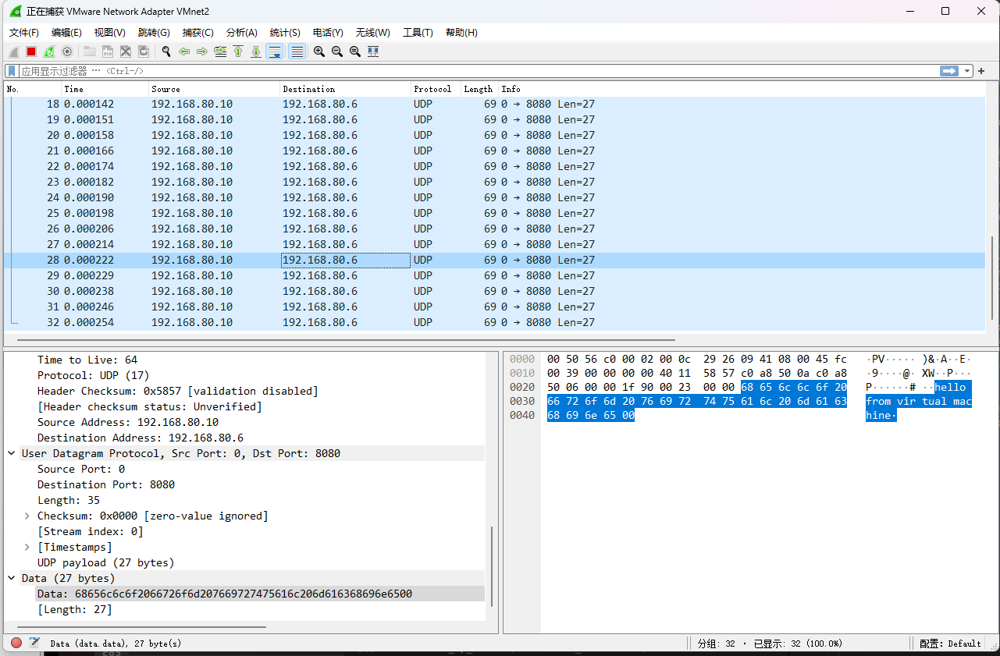

# DPDK

## 信息

姓名：杨景凯
学号：520021910550
邮箱：sxqxyjk2020@sjtu.edu.cn

## Part1

1. What 's the purpose of using hugepage?
使用大页可以显著减少TLB Miss的数目（大致三个数量级）。这是因为可以从相同的页表项来获取更多数据，在局部性强的程序中，可以增加性能。
2. Take examples/helloworld as an example, describe the execution flow of DPDK programs?
所有DPDK程序都需要首先进行初始化，最后进行回收清理。特别地，对于examples/helloworld来说，其在进行初始化并验证成功后，向每个核（包括当前核心）发送运行的函数指针，使其运行函数。主线程（主核心）等待其他线程运行结束后，进行回收。
3. Read the codes of examples/skeleton, describe DPDK APIs related to sending and receiving packets.
负责收发包的API分别为：

- RTE_ETH_RX_BURST(端口号,队列号,缓冲区,收包数量)
- RTE_ETH_TX_BURST(端口号,队列号,缓冲区,发包数量)

其中，队列号的分配使得负载更加均衡。
4. Describe the data structure of 'rte_mbuf'.
每个mbuf的总长度由以下公式计算，即一个结构体，紧跟一个headroom，数据块，tailroom:

```c++
mbuf_size = sizeof(rte_mbuf) + headroom_size + data_size + tailroom_size
```



<center>mbuf图解，参考<a href="https://blog.csdn.net/qq_20817327/article/details/113871877">参考</a></center>



<center>rte_mbuf图解，参考<a href="https://blog.csdn.net/qq_20817327/article/details/113871877">参考</a></center>

对于rte_mbuf结构体来说，主要有一些指向当前地址指针如上所示，以及指向下一个结构体的指针pkt.next，以及一些常量，例如type（类型），pool（内存池），pkt.in_port（端口号）等。

## Part2

1. 验证
通过wireshark可以直观地验证结果。

2. 运行
通过输入命令：

```bash
make
cd build && ./basicfwd
```

即可执行。
3. 实现
首先初始化，申请mbuf，然后分别设置ethernet头，ip头和udp头，设置数据，然后发送。最后回收。
4. 故障处理
在实现过程中遇到的困难有很多，其中主要是对DPDK不熟悉导致的。包括首先尝试在WSL上安装但是发现无法定制模块；后续在实体机上安装但是无法使用wireshark监听包；由于环境变量未设置无法链接（已经在Makefile中添加）；长度设置冲突导致失败等。
